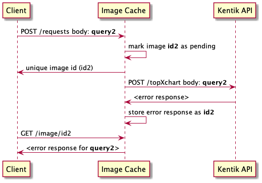

# Kentik Image Cache
Application for caching of images rendered by the _/query/topxchart_ Kentik API method.  
   
The application provides API method allowing to invoke _/query/topxchart_ Kentik API method and returns unique identifiers  
which can be later used to retrieve the corresponding image (or error message).   
  
TLS and eventual user authentication must be handled by external proxy (e.g. [Traefik](https://github.com/tiangolo/blog-posts/blob/master/deploying-fastapi-apps-with-https-powered-by-traefik/README.md))  
  
## API endpoints
| end-point | method | operation | request data | response data |
| :---------| :----- | :---------| :----------- | :------------ |
| /requests  | POST | Initiate query request to Kentik API’s /query/topxchart end-point | **api_query:** [JSON object](https://kb.kentik.com/v0/Ec04.htm#Ec04-Query_API_Request_JSON) (passed to Kentik API without modification), **ttl:** (optional int) desired storage duration in seconds | **On success:** image ID, **On error:** JSON error message |
| /image/{id}  | GET | Retrieve previously requested image | None | **On success:** Image data according to the format specified in the corresponding request, **On error:** Status code and error message returned by Kentik API |
| /info       | GET | Return information about cache content | None | JSON object |
| /favicon.ico | GET | Return favicon | None | image/x-icon |

## Image Identifiers
Unique image identifiers returned by the app are constructed as:  
`sha256(<query_data>).hexdigest_<expiration_time_in_unix_epoch>`  
Example:  
`4295aa38281c869ae8827320d407bf1dd1f38a7bf65af00551ce461e70f863d5\_1620973821.2844`

## Application configuration
The application has following configurable parameters which can be either provided in environment variables (variables names must be all capital letters) or in the `.env` file in the root folder of the app:  
  
  | parameter | required | purpose | default value |
  | :---------| :------: | :------ | :------------ | 
  | KT_AUTH_EMAIL | yes | Authentication to Kentik API | |
  | KT_AUTH_TOKEN | yes | Authentication to Kentik API | |
  | KENTIK_API_URL | no | URL of Kentik API service | https://api.kentik.com/api/v5 |
  | KENTIK_API_RETRIES  | no | Number of retries on transient failures | 3 |
  | KENTIK_API_TIMEOUT | no | Timeout for requests to Kentik API | 60 seconds |
  | DEFAULT_TTL| no | Default cache entry lifetime | 300 seconds |
  | STATUS_POLL_PERIOD  | no | Interval for polling for completion of cache entries | 3 seconds |
  | CACHE_PATH  | yes | Directory for storing cached content | |
  | CACHE_MAINTENANCE_PERIOD  | no | Interval for periodic cache pruning | 60 seconds |

## Basic Operations
### Happy Path


On POST request to the _/requests_ end-point, the Image Cache performs following actions:
1) generates unique image id
2) attempts to locate entry with the same id in the cache
   ```
   if not found
      create new pending entry storing the request body
      start background task for retrieving the image from Kentik API
   else
      store the image id of the entry
   ```
3) returns the image id to the client

On successful retrieval of the image from Kentik API, Image Cache:
1) stores the image data in the pending entry
2) marks the entry active

On GET request to the _/image/<id>_ end-point, the Image Cache:
1) attempts to locate the entry <id> in the cache
```
  if found
    if expired
      return 404 to the client
    while entry is pending
      wait for status_poll_period
    return 200 and image data to the client
  else
    return 404 error to the client
```

### Handling of Kentik API Errors


### Application Restart
The current design assumes that local storage used by the cache is persistent and services application/container restarts.
If this is not true, application restart will obviously cause all cached content to be lost.
On application restart, the Image Cache initializes the local cache before beginning to server requests on the 2 API end-points.
Cache initialization steps:
1) Load data to cache from filesystem
2) Walk all pending entries
   - remove expired entries
   - start retrieval of images from Kentik API (using the query data stored in pending entries) for remaining entries
3) Walk all active entries and remove expired ones

## Requirements
- Python 3.8 or newer
- FastAPI
- kentik-api 0.2.0 (or newer)

## Installation

### Deployment in Docker
The bellow procedure assumes:
- Unix/Linux-like operating system
- Docker executed on the host on which the image is built

#### Clone repo to local disk:
`https://github.com/kentik/kentik_image_cache.git`

#### Create docker image
```
cd kentik_image_cache
docker build -t kentik_image_cache .
```
#### Create cache directory (to be mounted in the container)
The directory should be located on filesystem with enough of disk space and must be readable and writeable
to the user with whose identity Docker containers are executed.
```
mkdir -p /opt/kentik_image_cache
```

#### Start the docker container
The bellow procedure passes Kentik authentication to the container via environment variables.
- _<kentik_user_mail>_ has to be replaced with the e-mail registered with the Kentik user
- _<kentik_api_token>_ has to be replaced with API token of that user.

**Access to Kentik API must be allowed from the external IP address of the Docker container**.
```
docker run -d --name kentik_image_cache \
    --env KT_AUTH_EMAIL=<kentik_user_mail> \
    --env KT_AUTH_TOKEN=<kentik_api_token> \
    -v /opt/kentik_image_cache:/cache -p 80:80 kentik_image_cache
```

### Local deployment for development
The bellow procedure assumes:
- Unix/Linux-like operating system
- Python 3.8 or newer installed as `python3`

#### Clone repo to local disk:
`https://github.com/kentik/kentik_image_cache.git`

#### Create virtual environment
```
cd kentik_image_cache
python3 -v venv venv
```

#### Install dependencies
```
venv/bin/pip3 install -r requirements.txt
```

#### Create cache directory
```
mkdir /tmp/cache
```

#### Create environment file with Kentik credentials
```
echo "KT_AUTH_EMAIL=<kentik_user_mail>" > .env
echo "KT_AUTH_TOKEN=<kentik_api_token>" >> .env
echo "CACHE_PATH=/tmp/cache" >> .env
```

#### Start the server with debug messages enabled and in self-reload mode
```
DEBUG=1 uvicorn app.main:app --reload
```

#### Test access
- API spec and tester: http://127.0.0.1:8000/docs
- Cache content info:  http://127.0.0.1:8000/info

